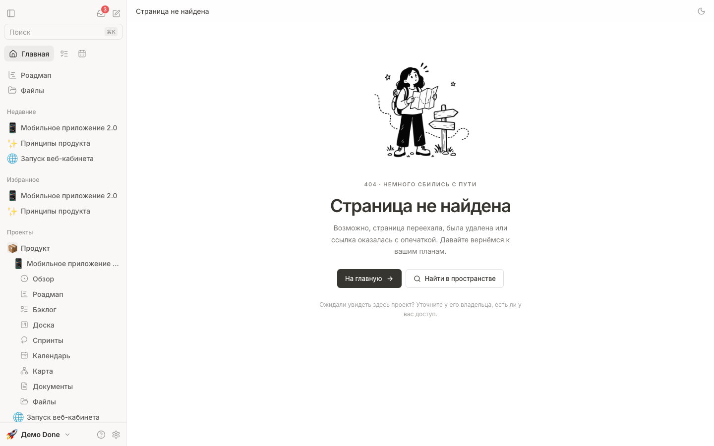
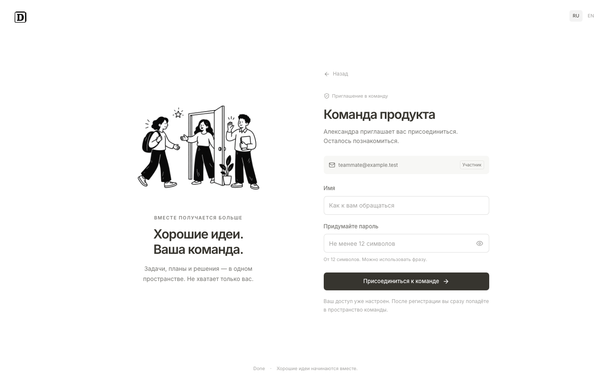
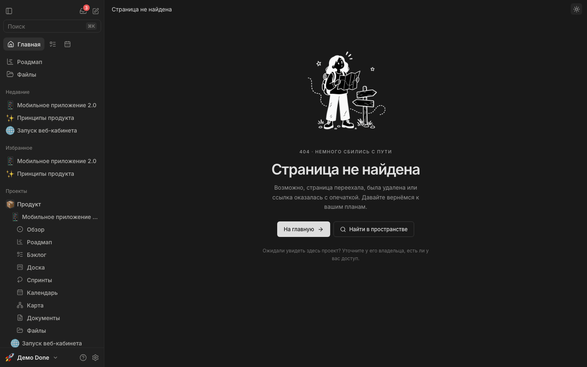
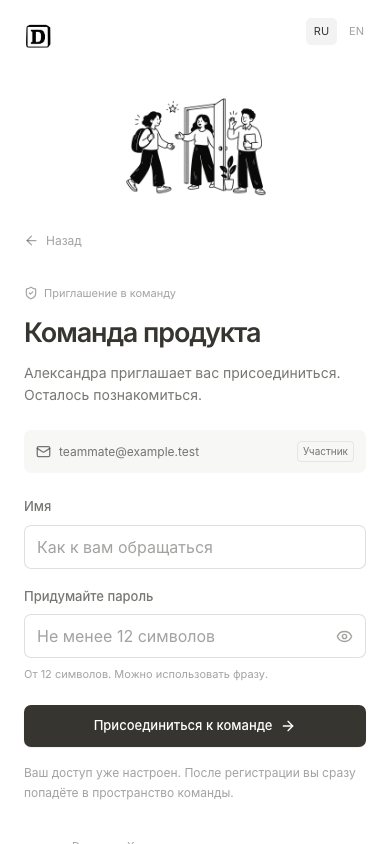

# Illustrated product states

Original artwork generated with the built-in image_gen tool (transparent PNG, 1536 × 1024). All production assets live in public/illustrations/states; no external image requests are needed.

Visual references supplied by the user:
- https://dribbble.com/shots/25494727-404-Page-Notion-Style
- https://dribbble.com/shots/23181554-Motion-illustrations-for-Notion

## Screen inventory and implementation

| Surface | States covered | Implementation |
| --- | --- | --- |
| Unknown route; missing project, item, document | 404, home, workspace search, access guidance | views/NotFound.tsx |
| Invitation (email, team link, project link) | Checking, ready, project invitation, account already exists, expired/revoked/turned off, connection failure, retry, signed-in visitor | components/AuthGate.tsx |
| Invite dialog and project sharing | Email + role, project access, team link on/off/reset, project link copy/level/reset/off, email not connected | components/access/InviteDialog.tsx, components/access/ProjectShare.tsx |
| Email settings | Not connected, connect with presets, connection/auth/host errors, connected, set by the server | views/settings/Mail.tsx |
| Invitation and password emails | Light and dark mail clients, plain text | server/mail.mjs, docs/previews/email |
| Password recovery | Request, email confirmation, checking, new password, expired link, connection failure and retry | components/AuthRecovery.tsx |
| Workspace route | Lazy loading, render failure with retry and home navigation | components/PageFeedback.tsx |
| Inbox | Unread cleared, no notifications, empty archive | views/Inbox.tsx |
| My work | Empty task selection, no filter matches, create task/reset | views/MyWork.tsx |
| Documents | First document, empty search, create/clear search | views/Docs.tsx |
| Files | First upload/link/folder, empty search, clear search | views/Files.tsx |
| Backlog | First item with inline creation | views/Backlog.tsx |
| Sprints | No active sprint, no history | views/Sprints.tsx |
| Project archive | Empty archive | components/ProjectArchive.tsx |
| Trash | Empty trash vs. no search matches | components/Trash.tsx |
| Invite results | Links to share when email is off or some letters failed | components/access/InviteDialog.tsx |

The shared StatePanel and StateIllustration components provide consistent spacing, semantic headings, decorative image semantics, responsive sizing and reduced-motion behavior. Dark mode reverses the monochrome artwork. Large illustrations are reserved for page-level states; compact boards, timelines, table rows and inline notices retain their existing lightweight treatment. The existing welcome, sign-in, setup, sign-out and onboarding flows remain in place. Missing resources intentionally do not disclose whether an inaccessible resource exists.

## Artwork prompts

### lost.png

Use case: illustration-story. Asset type: production UI spot illustration for Done, a calm project management app. Primary request: A friendly adult explorer with a small backpack holding an unfolded map, looking for the way, beside a tiny signpost with blank arrows. Small dotted wandering path, two tiny ink stars. Warm gently humorous lost-page metaphor. Style: original Notion-inspired editorial illustration, confident slightly imperfect black ink outlines, solid black hair and trousers, white clothing, minimal fine hatch marks, charming simple hand-drawn human proportions and faces. Strictly monochrome black and white, no gray gradients, no colors, no shadows, no 3D. Isolated centered compact landscape composition with generous transparent margins, all body parts and props in frame. Genuine transparent background, opaque white fills within characters. No text, letters, numbers, logos, badges, UI, borders, watermarks. Visually legible when rendered at 240 pixels wide. One cohesive scene, polished restrained vector-like ink drawing.

### team.png

Use case: illustration-story. Asset type: production UI spot illustration for Done, a calm project management app. Primary request: Two friendly adult teammates welcoming a third teammate through a simple open doorway, one waving, another carrying a blank notebook. A tiny plant beside the door, a single small star. Welcoming collaboration metaphor. Three figures max. Style: original Notion-inspired editorial illustration, confident slightly imperfect black ink outlines, solid black hair and trousers, white clothing, minimal fine hatch marks, charming simple hand-drawn human proportions and faces. Strictly monochrome black and white, no gray gradients, no colors, no shadows, no 3D. Isolated centered compact landscape composition with generous transparent margins, all body parts and props in frame. Genuine transparent background, opaque white fills within characters. No text, letters, numbers, logos, badges, UI, borders, watermarks. Visually legible when rendered at 240 pixels wide. One cohesive scene, polished restrained vector-like ink drawing.

### quiet.png

Use case: illustration-story. Asset type: production UI spot illustration for Done, a calm project management app. Primary request: A friendly adult person reclining on a simple chair with feet resting beside a neat stack of completed paper sheets, holding a warm mug, small plant nearby. Quiet satisfied pause after finishing work, no symbols or text on the papers. Style: original Notion-inspired editorial illustration, confident slightly imperfect black ink outlines, solid black hair and trousers, white clothing, minimal fine hatch marks, charming simple hand-drawn human proportions and faces. Strictly monochrome black and white, no gray gradients, no colors, no shadows, no 3D. Isolated centered compact landscape composition with generous transparent margins, all body parts and props in frame. Genuine transparent background, opaque white fills within characters. No text, letters, numbers, logos, badges, UI, borders, watermarks. Visually legible when rendered at 240 pixels wide. One cohesive scene, polished restrained vector-like ink drawing.

### workspace.png

Use case: illustration-story. Asset type: production UI spot illustration for Done, a calm project management app. Primary request: A friendly adult person sitting on the floor arranging three blank project cards beside an oversized open notebook, with a small pencil and tiny potted plant. Beginning a fresh project metaphor, simple expressive shapes. Style: original Notion-inspired editorial illustration, confident slightly imperfect black ink outlines, solid black hair and trousers, white clothing, minimal fine hatch marks, charming simple hand-drawn human proportions and faces. Strictly monochrome black and white, no gray gradients, no colors, no shadows, no 3D. Isolated centered compact landscape composition with generous transparent margins, all body parts and props in frame. Genuine transparent background, opaque white fills within characters. No text, letters, numbers, logos, badges, UI, borders, watermarks. Visually legible when rendered at 240 pixels wide. One cohesive scene, polished restrained vector-like ink drawing.

### letter.png

Use case: illustration-story. Asset type: production UI spot illustration for Done, a calm project management app. Primary request: A friendly adult person sitting beside a large open envelope, holding a small paper letter, with a tiny paper airplane overhead connected by a short dotted flight path. Receiving a message and reconnecting metaphor, calm helpful mood. Style: original Notion-inspired editorial illustration, confident slightly imperfect black ink outlines, solid black hair and trousers, white clothing, minimal fine hatch marks, charming simple hand-drawn human proportions and faces. Strictly monochrome black and white, no gray gradients, no colors, no shadows, no 3D. Isolated centered compact landscape composition with generous transparent margins, all body parts and props in frame. Genuine transparent background, opaque white fills within characters. No text, letters, numbers, logos, badges, UI, borders, watermarks. Visually legible when rendered at 240 pixels wide. One cohesive scene, polished restrained vector-like ink drawing.

## Verification

- TypeScript: passed.
- Unit suite: passed (`npm run check`).
- Production build: passed after final edits.
- Playwright: all 10 scenarios passed, including existing account and smoke flows.
- Visual inspection: desktop invitation, 390px invitation, 404 light/dark, expired invitation.
- Regression coverage: verified invitation identity; recoverable reset network failures; working 404 search/home; empty file-search recovery; failed lazy module recovery with navigation retained.

## Screenshots

